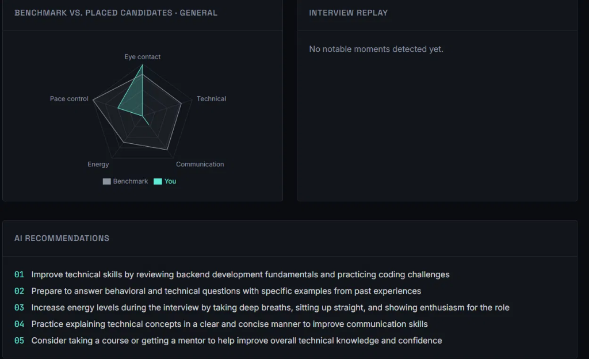
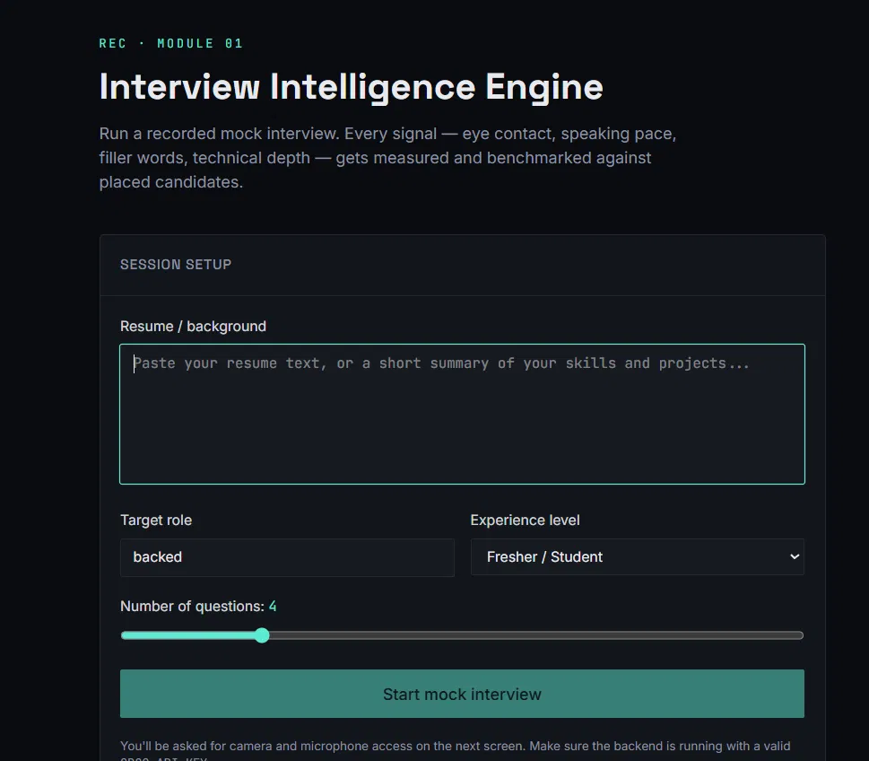
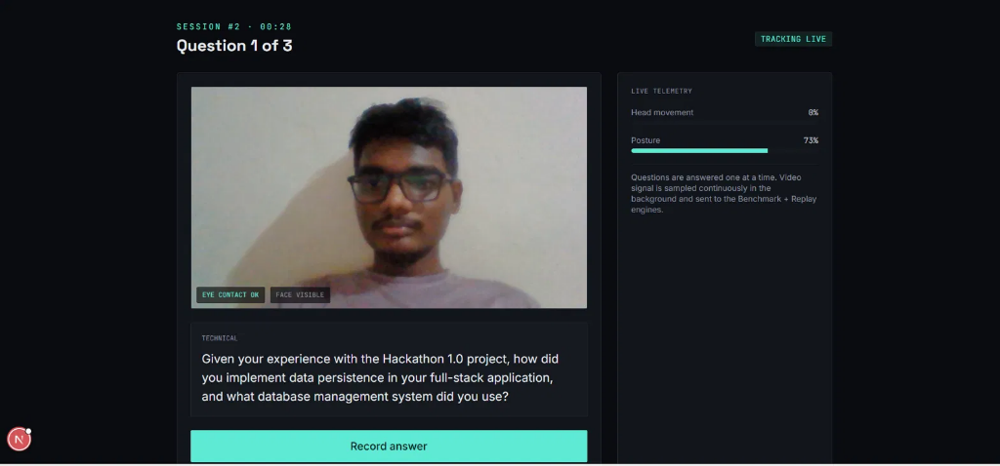
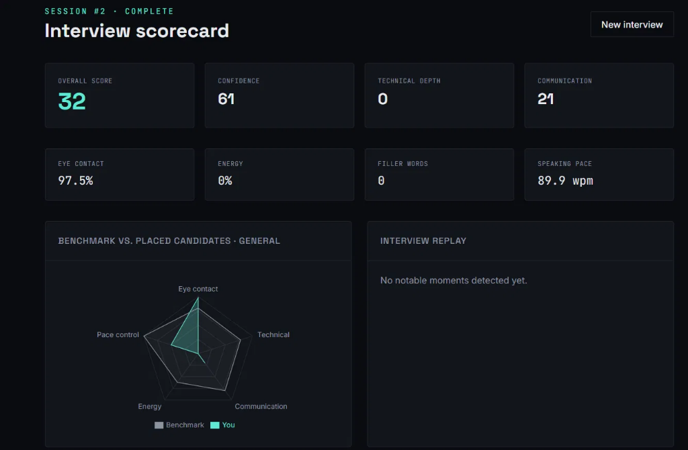
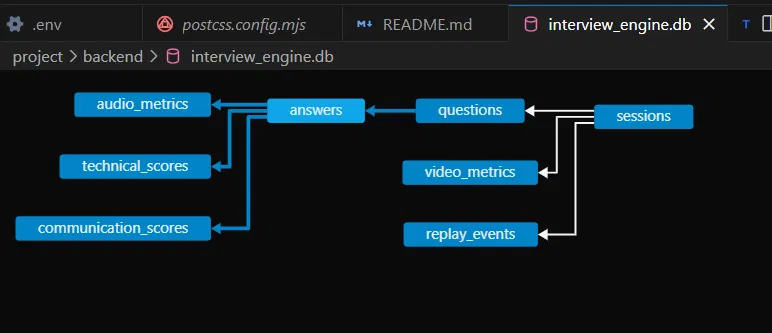
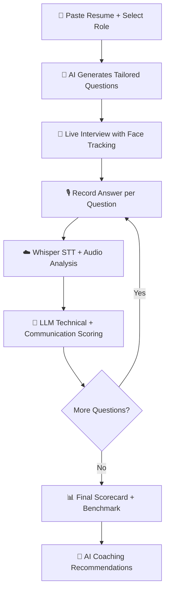

<div align="center">

# 🎯 Interview Intelligence Engine

### AI-Powered Mock Interview Platform with Real-Time Behavioral Analysis

[](https://interview-intelligence-engine.vercel.app/)
[](https://interview-intelligence-engine-1.onrender.com/)
[](https://python.org)
[](https://nextjs.org)
[](https://fastapi.tiangolo.com)

**Run a recorded mock interview where every signal — eye contact, speaking pace, filler words, vocal energy, technical depth — is measured by AI and benchmarked against placed candidates.**

[Live Demo](https://interview-intelligence-engine.vercel.app/) · [API Docs](https://interview-intelligence-engine-1.onrender.com/docs) · [Report Bug](https://github.com/GMGanesh2003/Interview_Intelligence_engine/issues)

</div>

---

## 📸 Screenshots

<table>
  <tr>
    <td width="50%">
      
      <p align="center"><b>Session Setup</b> — Paste resume, select role & experience level</p>
    </td>
    <td width="50%">
      
      <p align="center"><b>Live Interview</b> — Real-time face tracking & telemetry</p>
    </td>
  </tr>
  <tr>
    <td width="50%">
      
      <p align="center"><b>Scorecard</b> — Overall score, confidence, technical depth & more</p>
    </td>
    <td width="50%">
      
      <p align="center"><b>Benchmark & AI Recommendations</b> — Radar chart + coaching</p>
    </td>
  </tr>
</table>

---

## ✨ Key Features

| Feature | Description | Technology |
|---------|-------------|------------|
| 🎙️ **AI Question Generation** | Resume-aware questions tailored to role & experience | Groq LLaMA 3.3 70B |
| 📹 **Real-Time Video Tracking** | Eye contact, head movement, posture & face visibility | MediaPipe Face Landmarker |
| 🗣️ **Speech-to-Text** | Accurate transcription with word-level timestamps | Groq Whisper Large v3 Turbo |
| 🔊 **Audio Intelligence** | Speaking pace (WPM), pause detection, filler words, vocal energy | Librosa + NumPy |
| 📊 **Technical Depth Analysis** | Correctness, depth, clarity, examples, reasoning & STAR detection | LLaMA 3.3 70B (structured JSON) |
| 💬 **Communication Analysis** | Grammar, clarity, conciseness & professionalism scoring | LLaMA 3.3 70B (structured JSON) |
| 🏆 **Benchmark Engine** | Radar chart comparing you against placed candidates | Statistical aggregation |
| 🔄 **Interview Replay** | Timestamped event markers for filler words, pauses & strong moments | Event-driven timeline |
| 🤖 **AI Coaching** | Personalized improvement recommendations from your metrics | LLaMA 3.3 70B |
| 🔐 **Authentication** | Google OAuth 2.0 + Guest login mode | NextAuth.js + Google Auth |

---

## 🏗️ System Architecture

```
┌─────────────────────────────────────────────────────────────────────┐
│                         FRONTEND (Next.js 16)                       │
│                         Deployed on Vercel                          │
│  ┌──────────┐  ┌──────────────┐  ┌───────────┐  ┌──────────────┐  │
│  │  Session  │  │    Live      │  │ Scorecard │  │  Benchmark   │  │
│  │  Setup    │  │  Interview   │  │ Dashboard │  │  + Replay    │  │
│  │  Page     │  │  Page        │  │  Page     │  │  Page        │  │
│  └────┬─────┘  └──────┬───────┘  └─────┬─────┘  └──────┬───────┘  │
│       │               │                │               │           │
│       │    ┌──────────────────────┐     │               │           │
│       │    │  MediaPipe Face      │     │               │           │
│       │    │  Landmarker (WASM)   │     │               │           │
│       │    │  ┌────────────────┐  │     │               │           │
│       │    │  │ Eye Contact    │  │     │               │           │
│       │    │  │ Head Movement  │  │     │               │           │
│       │    │  │ Posture Score  │  │     │               │           │
│       │    │  │ Face Visibility│  │     │               │           │
│       │    │  └────────────────┘  │     │               │           │
│       │    └──────────────────────┘     │               │           │
│       │               │                │               │           │
│  ─────┴───────────────┴────────────────┴───────────────┴────────── │
│                          REST API Calls                             │
│                    (via NEXT_PUBLIC_API_BASE)                        │
└──────────────────────────────┬──────────────────────────────────────┘
                               │  HTTPS
                               ▼
┌─────────────────────────────────────────────────────────────────────┐
│                     BACKEND (FastAPI + Python)                       │
│                       Deployed on Render                             │
│                                                                     │
│  ┌─────────────────────────────────────────────────────────────┐    │
│  │                    FastAPI Application                       │    │
│  │                                                             │    │
│  │  Module 1: Session Manager ─── Create/manage sessions       │    │
│  │  Module 2: Question Engine ─── Groq LLaMA → tailored Qs    │    │
│  │  Module 3: Video Intelligence ─ Store telemetry metrics     │    │
│  │  Module 4: Audio Intelligence ─ Librosa analysis pipeline   │    │
│  │  Module 5: Transcript Engine ── Groq Whisper STT            │    │
│  │  Module 6: Technical Analyzer ─ LLM depth scoring           │    │
│  │  Module 7: Communication ────── LLM comm scoring            │    │
│  │  Module 8: Benchmark Engine ─── vs. placed candidates       │    │
│  │  Module 9: Interview Replay ─── Timeline event markers      │    │
│  │  Dashboard: Aggregate ────────── Final scorecard + coaching  │    │
│  └─────────────────────────────────────────────────────────────┘    │
│                               │                                     │
│  ┌────────────┐    ┌──────────┴───────────┐    ┌────────────────┐  │
│  │  SQLite    │    │   Groq Cloud API     │    │   Librosa      │  │
│  │  Database  │    │  • LLaMA 3.3 70B     │    │   + SciPy      │  │
│  │            │    │  • Whisper v3 Turbo   │    │   + NumPy      │  │
│  └────────────┘    └──────────────────────┘    └────────────────┘  │
└─────────────────────────────────────────────────────────────────────┘
```

---

## 🗄️ Database Schema

<div align="center">
  
</div>

The system uses **8 interconnected tables** to capture every dimension of an interview:

| Table | Purpose |
|-------|---------|
| `sessions` | Interview session metadata (user, role, experience, status) |
| `questions` | AI-generated questions linked to sessions |
| `answers` | Candidate responses with audio path & transcript |
| `audio_metrics` | Speaking speed, pauses, filler words, vocal energy |
| `video_metrics` | Eye contact, head movement, posture (sampled every 1s) |
| `technical_scores` | Correctness, depth, clarity, examples, reasoning, STAR |
| `communication_scores` | Grammar, clarity, conciseness, professionalism |
| `replay_events` | Timestamped markers (filler words, long pauses, strong answers) |
| `benchmark_profiles` | Reference metrics from placed candidates |

---

## 🔧 Tech Stack

### Frontend
| Technology | Purpose |
|-----------|---------|
| **Next.js 16** | React framework with App Router |
| **TypeScript** | Type-safe development |
| **Tailwind CSS 4** | Utility-first styling |
| **MediaPipe Face Landmarker** | Real-time face mesh + head pose estimation (WASM/GPU) |
| **Recharts** | Radar charts & data visualization |
| **NextAuth.js** | Google OAuth 2.0 authentication |
| **pdf.js** | Client-side PDF resume parsing |

### Backend
| Technology | Purpose |
|-----------|---------|
| **FastAPI** | High-performance async Python API framework |
| **Groq API** | Ultra-fast LLM inference (LLaMA 3.3 70B) |
| **Groq Whisper** | Speech-to-text with word-level timestamps |
| **Librosa** | Audio signal processing (RMS, pYIN pitch tracking) |
| **scikit-learn** | Statistical analysis for benchmarking |
| **SQLAlchemy** | ORM for SQLite database |
| **Google Auth** | Server-side OAuth token verification |

### Infrastructure
| Service | Purpose |
|---------|---------|
| **Vercel** | Frontend hosting with edge network |
| **Render** | Backend hosting with Docker containers |
| **Docker** | Containerized backend with ffmpeg + libsndfile |

---

## 🚀 Getting Started

### Prerequisites

- **Node.js** ≥ 18
- **Python** ≥ 3.11
- **Groq API Key** — [Get free at console.groq.com](https://console.groq.com/keys)
- **Google OAuth Credentials** — [Google Cloud Console](https://console.cloud.google.com/apis/credentials) (optional, guest mode available)

### 1. Clone the repository

```bash
git clone https://github.com/GMGanesh2003/Interview_Intelligence_engine.git
cd Interview_Intelligence_engine/project
```

### 2. Backend Setup

```bash
cd backend

# Create virtual environment
python -m venv .venv
source .venv/bin/activate  # Windows: .venv\Scripts\activate

# Install dependencies
pip install -r requirements.txt

# Configure environment
cp .env.example .env
# Edit .env and add your GROQ_API_KEY
```

**Backend `.env` configuration:**

```env
GROQ_API_KEY=your_groq_api_key_here
GROQ_LLM_MODEL=llama-3.3-70b-versatile
GROQ_WHISPER_MODEL=whisper-large-v3-turbo
DATABASE_URL=sqlite:///./interview_engine_v2.db
FRONTEND_ORIGIN=http://localhost:3000
GOOGLE_CLIENT_ID=your_google_client_id_here
```

```bash
# Start the backend server
uvicorn app.main:app --reload --port 8000
```

### 3. Frontend Setup

```bash
cd ../frontend

# Install dependencies
npm install

# Configure environment
cp .env.example .env.local
# Edit .env.local
```

**Frontend `.env.local` configuration:**

```env
NEXT_PUBLIC_API_BASE=http://localhost:8000
GOOGLE_CLIENT_ID=your_google_client_id
GOOGLE_CLIENT_SECRET=your_google_client_secret
NEXTAUTH_SECRET=any_random_secret_string
NEXTAUTH_URL=http://localhost:3000
```

```bash
# Start the frontend dev server
npm run dev
```

### 4. Open the app

Navigate to **[http://localhost:3000](http://localhost:3000)** — sign in with Google or continue as Guest, and start your mock interview!

---

## 🐳 Docker Setup

Run the entire stack with a single command:

```bash
cd project
docker compose up --build
```

This starts both the frontend (port 3000) and backend (port 8000) with all system dependencies pre-installed.

---

## 📡 API Endpoints

| Method | Endpoint | Description |
|--------|----------|-------------|
| `POST` | `/api/sessions` | Create a new interview session & generate questions |
| `GET` | `/api/sessions/{id}/questions` | Get questions for a session |
| `POST` | `/api/answers` | Submit audio answer → transcribe + analyze |
| `POST` | `/api/sessions/{id}/video-metrics` | Batch upload video telemetry samples |
| `POST` | `/api/sessions/{id}/complete` | Mark session as completed |
| `GET` | `/api/sessions/{id}/dashboard` | Get aggregated scorecard with AI recommendations |
| `GET` | `/api/sessions/{id}/benchmark` | Get benchmark comparison (user vs. placed candidates) |
| `GET` | `/api/sessions/{id}/replay` | Get timestamped replay events |

> 📖 Full interactive API docs available at [`/docs`](https://interview-intelligence-engine-1.onrender.com/docs) (Swagger UI)

---

## 🔬 How It Works

### Interview Flow



### Module Pipeline (Per Answer)

1. **Audio Upload** → WebM blob sent from browser
2. **Whisper Transcription** → Full text + word-level timestamps
3. **Audio Intelligence** → Librosa computes speaking speed, pauses, filler words, RMS energy + pitch variation
4. **Technical Analysis** → LLaMA evaluates correctness, depth, clarity, examples, reasoning + STAR framework detection
5. **Communication Analysis** → LLaMA scores grammar, clarity, conciseness, professionalism
6. **Replay Events** → Filler words & long pauses logged with timestamps
7. **Dashboard Aggregation** → All scores combined into overall score + confidence composite

### Scoring Algorithm

```
Confidence = (Eye Contact % × 0.4) + (Posture × 100 × 0.3) + (Energy × 100 × 0.3) - Filler Penalty

Overall Score = (Technical Avg × 0.4) + (Communication Avg × 0.25) 
              + (Confidence × 0.2) + (Eye Contact % × 0.15)
```

---

## 📁 Project Structure

```
project/
├── backend/
│   ├── app/
│   │   ├── main.py              # FastAPI app entry point + CORS config
│   │   ├── models.py            # SQLAlchemy models (9 tables)
│   │   ├── schemas.py           # Pydantic request/response schemas
│   │   ├── database.py          # SQLite engine + session factory
│   │   ├── auth.py              # Google OAuth token verification
│   │   ├── groq_client.py       # Groq API wrapper (LLM + Whisper)
│   │   ├── audio_analysis.py    # Librosa-based audio intelligence
│   │   ├── seed.py              # Benchmark profile seeding
│   │   └── routers/
│   │       ├── sessions.py      # Session CRUD + question generation
│   │       ├── answers.py       # Answer submission + full analysis pipeline
│   │       ├── video.py         # Video telemetry batch ingestion
│   │       ├── dashboard.py     # Aggregated scorecard + AI recommendations
│   │       ├── benchmark.py     # User vs. placed candidates comparison
│   │       └── replay.py        # Replay event timeline
│   ├── requirements.txt
│   └── Dockerfile
├── frontend/
│   ├── src/
│   │   ├── app/
│   │   │   ├── page.tsx           # Session setup (home page)
│   │   │   ├── interview/[id]/    # Live interview with webcam
│   │   │   ├── results/[id]/      # Scorecard + benchmark + replay
│   │   │   └── api/auth/          # NextAuth.js API routes
│   │   ├── components/ui/         # Reusable UI components
│   │   └── lib/
│   │       ├── api.ts             # Backend API client
│   │       ├── useFaceTracking.ts # MediaPipe face tracking hook
│   │       └── useAudioRecorder.ts# Browser audio recording hook
│   └── package.json
├── docker-compose.yml
└── README.md
```

---

## 🌐 Deployment

### Frontend → Vercel

1. Connect your GitHub repo to [Vercel](https://vercel.com)
2. Set **Root Directory** to `frontend`
3. Add environment variables:
   - `NEXT_PUBLIC_API_BASE` = your Render backend URL
   - `NEXTAUTH_URL` = your Vercel frontend URL
   - `GOOGLE_CLIENT_ID`, `GOOGLE_CLIENT_SECRET`, `NEXTAUTH_SECRET`

### Backend → Render

1. Create a new **Web Service** on [Render](https://render.com)
2. Set **Environment** to `Docker` and **Root Directory** to `backend`
3. Add environment variables:
   - `FRONTEND_ORIGIN` = your Vercel frontend URL
   - `GROQ_API_KEY`, `GROQ_LLM_MODEL`, `GROQ_WHISPER_MODEL`
   - `DATABASE_URL`, `GOOGLE_CLIENT_ID`

---

## 🧠 AI Models Used

| Model | Provider | Purpose |
|-------|----------|---------|
| **LLaMA 3.3 70B Versatile** | Groq | Question generation, technical analysis, communication scoring, coaching recommendations |
| **Whisper Large v3 Turbo** | Groq | Speech-to-text transcription with word timestamps |
| **MediaPipe Face Landmarker** | Google | Real-time face mesh, head pose estimation, eye contact detection |

---

## 👨‍💻 Author

**Ganesh M**

- GitHub: [@GMGanesh2003](https://github.com/GMGanesh2003)

---

## 📄 License

This project is open source and available under the [MIT License](LICENSE).

---

<div align="center">
  <br/>
  <b>⭐ If this project helped you, give it a star! ⭐</b>
  <br/><br/>
  Built with 💚 using Next.js, FastAPI, Groq AI & MediaPipe
</div>
